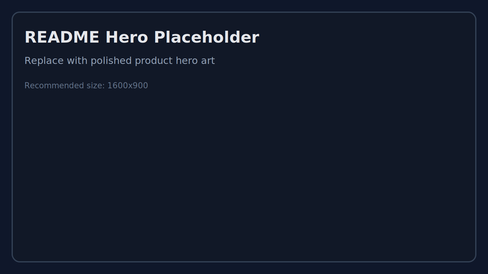
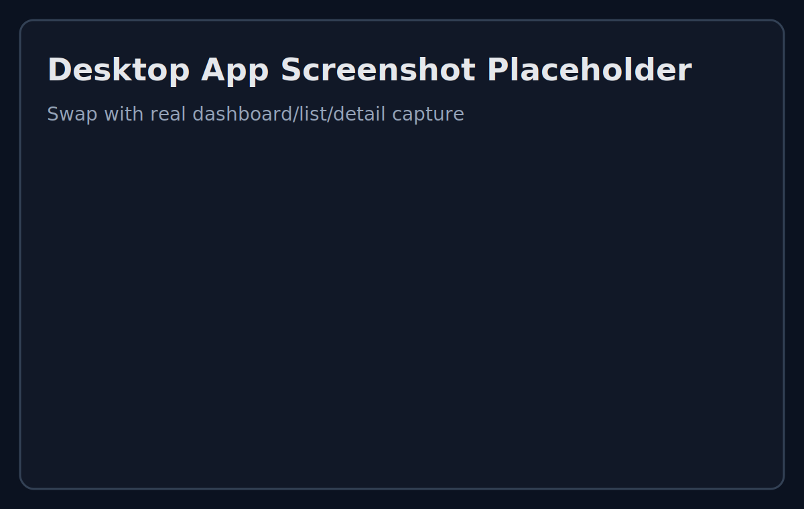
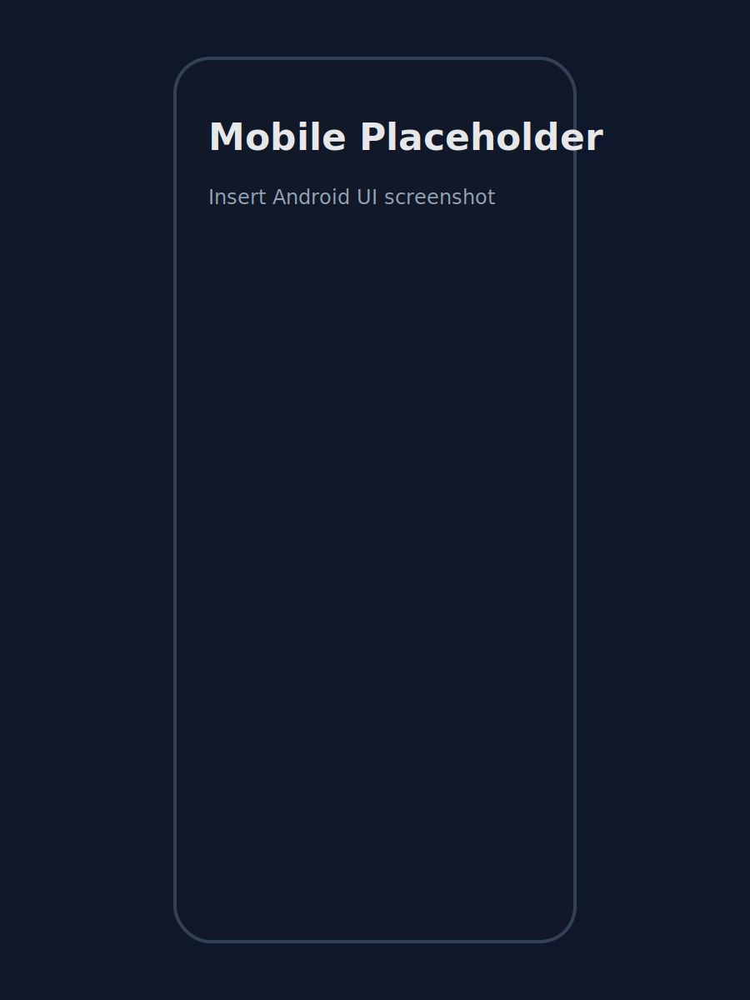

# Armadillo



Armadillo is a secure, cross-platform password vault focused on fast local unlock, encrypted cloud sync, and practical enterprise controls.

Current version: `1.0.0-beta.1`

## Product Snapshot

- End-to-end encrypted vault data (decrypts client-side only)
- Local-file mode or cloud-only mode
- Desktop (Electron), Web (Vite), and Android support
- Import support for Google Password CSV + KeePass XML/CSV
- Passkey quick unlock (desktop/web) + biometric quick unlock (Android) + Android autofill bridge
- Enterprise-ready foundations: org-scoped auth context, RBAC, audit endpoints, health/metrics endpoints

## App Preview

### Desktop Experience



### Mobile Experience



## Why Armadillo

- Private by default: encrypted snapshots only, no plaintext vault storage in sync backends
- Flexible deployment: managed sync provider or self-hosted gateway
- Fast workflow: quick search, folder organization, import/export, and mobile navigation
- Upgrade path for teams: entitlement tiers and enterprise capability gates

## Platform Support

- Web app
- Windows desktop installer (`.exe`)
- Android APK

## Quick Start

```bash
npm install
npm run dev
```

Web dev server runs with Vite.

## Desktop Run

```bash
npm run dev:electron
```

## Build Artifacts

### Windows Installer

```bash
npm run dist:win
```

Output:

- `release/Armadillo-Setup-<version>-x64.exe`

Signing:

- Set `CSC_LINK` and `CSC_KEY_PASSWORD` for signed release artifacts.
- Validate signing env locally with:

```bash
npm run release:check-signing
```

### Android APK

```bash
npm run apk:debug
npm run apk:release
npm run apk:fastlane
```

Output:

- `android/app/build/outputs/apk/...`

## Cloud + Sync Setup

Client env example:

```bash
VITE_CONVEX_URL=https://<your-deployment>.convex.cloud
VITE_CONVEX_HTTP_URL=https://<your-deployment>.convex.site
VITE_SYNC_PROVIDER=convex
VITE_SYNC_BASE_URL=
VITE_SYNC_AUTH_TOKEN=
VITE_BILLING_URL=https://example.com/upgrade
VITE_ENTITLEMENT_JWKS={"keys":[{"kty":"OKP","crv":"Ed25519","x":"<public-x>","kid":"dev-key","alg":"EdDSA","use":"sig"}]}
VITE_UPDATE_MANIFEST_URL=./update-manifest.json
VITE_UPDATE_CHANNEL=production
```

`VITE_SYNC_PROVIDER`:

- `convex` (default)
- `self_hosted`

## Self-Hosted Gateway

Run local gateway:

```bash
npm run sync:selfhost:dev
```

Set client env:

```bash
VITE_SYNC_PROVIDER=self_hosted
VITE_SYNC_BASE_URL=http://localhost:8787
```

Optional Postgres migration bootstrap:

```bash
SYNC_DATABASE_URL=postgres://<user>:<pass>@<host>:5432/<db> npm run sync:selfhost:migrate
```

## Entitlements

Generate local signing keys:

```bash
npm run entitlement:keygen
```

Sign a development entitlement token:

```bash
ENTITLEMENT_DEV_PRIVATE_JWK='<private-jwk-json>' npm run entitlement:sign -- --tier enterprise --sub dev-user --days 30
```

Manual signed token input is kept as a break-glass/admin path in settings.

## Device Update Channels

- `production` channel:
- Web: GitHub Pages release deploys (tag-based)
- Android: managed store path (stable releases)
- Desktop: stable signed installers
- `fastlane-android` channel:
- Android dev flavor (`com.armadillo.vault.dev`) for internal + pilot tester fast iteration via Firebase App Distribution
- Desktop fast lane is local-build only; pilot desktop stays on stable channel
- OTA bundle/code-push updates are intentionally not used

The app checks `public/update-manifest.json` (or `VITE_UPDATE_MANIFEST_URL`) and surfaces update status in Settings under **General -> App & Updates**.
Keep `public/update-manifest.json` aligned with each production release and fast-lane drop so status and enforcement remain accurate.

## Security Notes

- Local vault KDF: Argon2id (legacy PBKDF2 unlock compatibility retained)
- Cloud stores encrypted saves only
- Passkey and biometric quick unlock are device-local
- Self-hosted v2 API includes org-scoped auth context, RBAC, audit, and ops endpoints

## Quality Gate

```bash
npm run ci:check
```

Includes lint, typecheck, tests, and production web build.

## GitHub Deployment Pipeline (Web + Convex)

This repo now includes `.github/workflows/deploy.yml` with tag-based staged deployment:

- Any `v*` tag deploys to staging first
- Only stable tags (`vX.Y.Z`) can promote to production
- Production deploys are gated by GitHub Environment approvals
- Existing CI workflow remains the quality gate before deployment

### Trigger rules

- Pre-release tag example: `v1.0.0-beta.2` -> staging only
- Stable tag example: `v1.0.0` -> staging then production (after approval)
- Manual run via `workflow_dispatch` supports `release_tag`, `rollback_tag`, and `promote_to_production`

### One-time GitHub setup

1. Enable **GitHub Pages** with source: **GitHub Actions**
2. Create `staging` and `production` environments
3. Add required reviewers on `production` environment
4. Add environment secrets in both `staging` and `production`:
- `CONVEX_DEPLOY_KEY`
- `VITE_CONVEX_URL`
- `VITE_CONVEX_HTTP_URL`
- `VITE_SYNC_PROVIDER` (set to `convex`)
- `VITE_BILLING_URL`
- `VITE_ENTITLEMENT_JWKS`
- `VITE_SYNC_BASE_URL` (optional)
- `VITE_SYNC_AUTH_TOKEN` (optional)
5. Add branch protection for `main` with required CI status checks

### GitHub Pages layout

- Staging latest: `/staging/latest/`
- Staging by tag: `/staging/<tag>/`
- Production latest: `/`
- Production by tag: `/releases/<tag>/`

## GitHub Fast-Lane Pipeline (Android)

This repo also includes `.github/workflows/fastlane-android.yml` for non-store tester delivery.

Triggers:

- Push to `main`
- Pre-release tags like `v1.0.0-beta.2` or `v1.0.0-rc.1`
- Manual `workflow_dispatch`

Behavior:

- Runs `npm run ci:check`
- Builds/syncs web assets into Capacitor Android
- Builds signed `dev` flavor APK (`applicationIdSuffix .dev`)
- Distributes to Firebase App Distribution tester groups
- Publishes install links + commit SHA in workflow summary

Required repository secrets:

- `FIREBASE_APP_ID_ANDROID`
- `FIREBASE_SERVICE_ACCOUNT_JSON`
- `FIREBASE_TESTER_GROUPS`
- `ANDROID_KEYSTORE_BASE64`
- `ANDROID_KEY_ALIAS`
- `ANDROID_KEYSTORE_PASSWORD`
- `ANDROID_KEY_PASSWORD`

## Documentation

- `services/sync-gateway/README.md` for self-hosted endpoint and env details
- `docs/security/*` for security policies/runbooks
- `docs/compliance/*` for SOC2/GDPR readiness drafts
- `docs/operations/*` for SLO and backup drill baselines

## Art Placeholders To Replace

- `docs/assets/readme/hero-placeholder.svg`
- `docs/assets/readme/desktop-placeholder.svg`
- `docs/assets/readme/mobile-placeholder.svg`

Recommended replacements:

- Hero art: 1600x900
- Desktop screenshot: 1200x760
- Mobile screenshot: 900x1200
